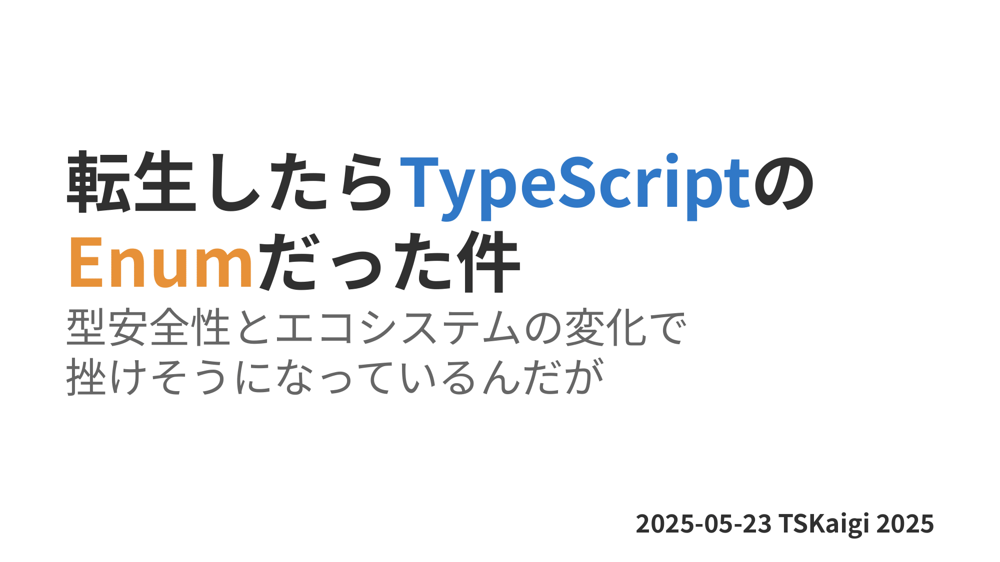
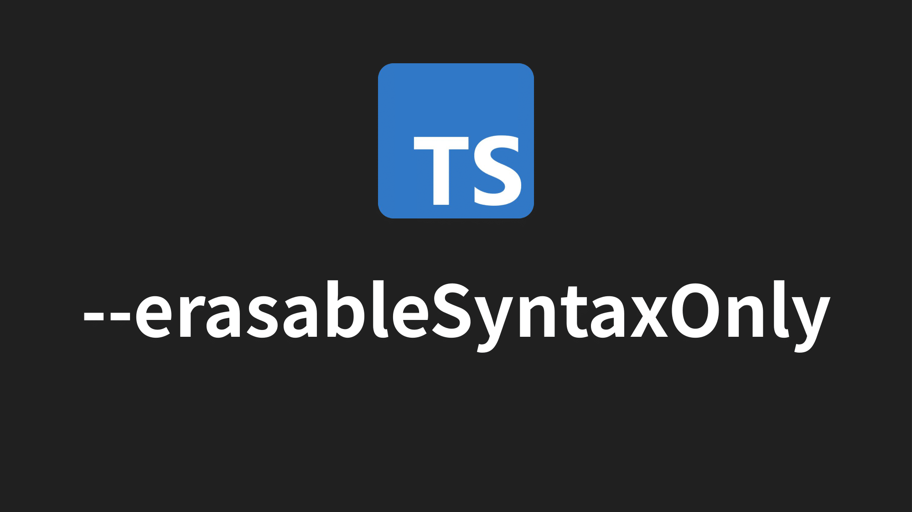
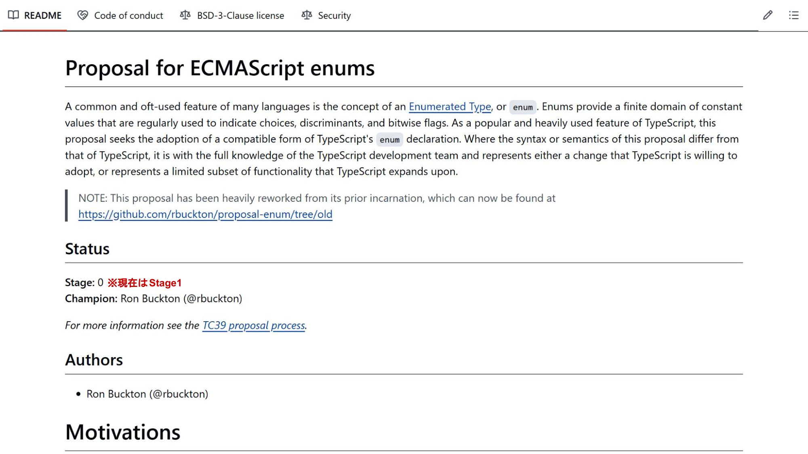
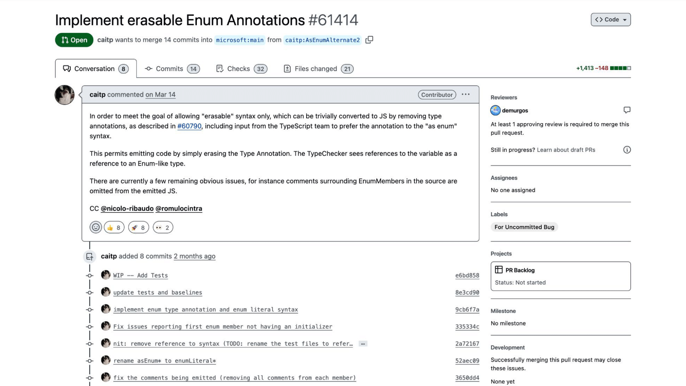

## 発表概要

「…ここは、一体？」

気づけば俺は、TypeScriptのEnumとして異世界転生していた。与えられたのは名前付き定数を表現する力「列挙型」。
しかし型安全性を重視する世界において、Union型とconst assertionsたちが我が物顔で闊歩し、俺の居場所を奪っていくのであった。

可読性と保守性を高めるために生まれたはずの俺が、今や時代遅れの遺物扱い。
さらに追い打ちをかけるように、Node.jsの「--experimental-strip-types」とTypeScriptの「--erasableSyntaxOnly」のオプションたちが、存在そのものを消し去ろうとする。

「このままでは…このままでは俺は消えてしまうのか…？」

それでも俺は諦めない。同じように居場所を失いかけている仲間たちと共に、俺は立ち上がる。型安全性、エコシステム、そして自身の存在意義についてを考える旅が今始まろうとしていた…。

---

この発表ではTypeScriptにおけるEnumが辿ってきた歴史とその苦境についてを解説していきます。聴者がEnumを使うことを改めて見つめ直すような内容を提供いたします。

## 発表内容

この物語の主人公は「列挙 純」という名前の男性です。都内某所でシステムエンジニアとして働いていて、主にJavaを使っています。

静的型付け言語が大好きで、最近はTypeScriptという言語についても興味が湧いてきました。

そんな彼は最近気になっていたカンファレンスのTSKaigiが開催されると聞き、チケットを申し込み、当日会場へと向かっていました。

その道中突如として暴走したトラックが彼の前に現れ、彼の視界は一気に真っ暗になりました。

次に彼が目を覚ましたのは、見知らぬ暗闇の中。そこからぼんやりと光が差し込んできて、天から声が響きました。

「列挙 純よ、目覚めなさい」

「あなたはこれから役割を与えられてJavaScriptの世界で生きることになる」

「それはTypeScriptのEnumだ」

彼はTypeScriptという国で、**列挙型**として生きていく運命を背負わされたのです。

Javaで長年Enumを使いこなしてきた彼は、TypeScriptでもその力が存分に発揮されました。

定数のセットとしてまとめて見やすくしたり、定義した定数に値を付与したり、数値の逆マッピングができたりと、様々な能力を発揮しTypeScriptの国民から慕われていました。

しかし彼が活躍しているその裏で、次第に不満の声が上がり始めました。

数値上の型安全性問題、バンドルサイズやTree Shakingが効かないこと、そもそも逆マッピングなんかしねぇよと、列挙の役割を疑うようになってきます。

列挙は自身の間違った挙動は直していったのですが、徐々に人々からはas constでのオブジェクトリテラルやUnion型といったものたちがEnumよりもマシだと考えるようになりました。

さらに彼に追い打ちをかけることが起きます。

Node.js国ではTypeScript国との交流を活発にさせるため「experimental-strip-types」という型注釈を除去する新たな法律を制定しました

さらにTypeScript国からは「erasableSyntaxOnly」というEnumを含むTypeScript特有のコントラクトを警告する法律を制定しました。

これらの法律が制定され、EnumといったTypeScriptでの固有の役割をもつ者たちの立場はどんどんなくなっていきました。

列挙純はTypeScript国ではもはや居場所を失いつつあり、深い絶望の中にいました。

「俺は、この世界に転生してきたのに、これからどう役立てばいいんだろう…？」

失意の中、彼はTypeScript国には入られなくなり、あてもなく彷徨っていました。

そのとき、彼に対して歩み寄ってくる一人の人物が現れました。

その人物は、ECMA International国の王様でした。

そして王様は言いました。「列挙よ、君の力が必要だ。我々の国に来て、新たな役割を果たしてほしい」と。

そうしてECMA International国では新たな仕様としてEnumを正式にJavaScriptの一部として取り込もうとする「Proposal for ECMAScript enums」が動き出したのです。

役割がなくなったと思われたTypeScript国でもEnumの型注釈を作ることで列挙型を生かしつつ型情報を削除できないかという声もあげられています。

そう、Enumの価値を理解し、彼を必要としている人たちは居たのです。

居場所がなくなったと思われた列挙の役割が見直され、`as const`やUnion型らと一緒に肩を並べて笑える日がまた来るかもしれません。

そう、これは終わりではなく、新たな始まりなのです。

この物語は当初は「Enumとして異世界転生した列挙純がどん底に落ちる」というストーリーでした。

しかしお察しの通り、この話はいつの間にか **なろう系** から **追放無双系** への物語に変わりました。

ここで次回作のタイトルについてを発表します。

『パーティーから追放された俺、ECMAScriptの一員として、TypeScriptで無双してやります！』

お楽しみにください。

ーーーすみません、ここで緊急ニュースです。

なんと、次回作を執筆する予定の作者が、Microsoftからレイオフされてしまったとのことです。

これにより、タイトルがそのままの形では…ちょっと使えない雰囲気になってしまいました。

というわけで、タイトルは改めまして、

『パーティーから追放された俺、ECMAScriptの一員としてTypeScriptで無双できるのかな…？』

に変更されました。

いずれにせよ列挙 純の次回作に、皆様ご期待ください。

## 参考資料

- [TypeScript: Handbook - Enums](https://www.typescriptlang.org/docs/handbook/enums.html)
- [列挙型 (enum) | TypeScript入門『サバイバルTypeScript』](https://typescriptbook.jp/reference/values-types-variables/enum)
  - [列挙型(enum)の問題点と代替手段 | TypeScript入門『サバイバルTypeScript』](https://typescriptbook.jp/reference/values-types-variables/enum/enum-problems-and-alternatives-to-enums)
- [さようなら、TypeScript enum - 株式会社カブク](https://www.kabuku.co.jp/developers/good-bye-typescript-enum)
- [TypeScriptのenumを使わないほうがいい理由を、Tree-shakingの観点で紹介します](https://engineering.linecorp.com/ja/blog/typescript-enum-tree-shaking)
- [tc39/proposal-enum: Proposal for ECMAScript enums](https://github.com/tc39/proposal-enum)
- [Why does TypeScript PM advice not to use const enum? If so, why not take out from language SPEC · Issue #30590 · microsoft/TypeScript](https://github.com/Microsoft/TypeScript/issues/30590)
- [Implement erasable Enum Annotations by caitp · Pull Request #61414 · microsoft/TypeScript](https://github.com/microsoft/TypeScript/pull/61414)
- [https://x.com/rbuckton/status/1922364558426911039](https://x.com/rbuckton/status/1922364558426911039)
